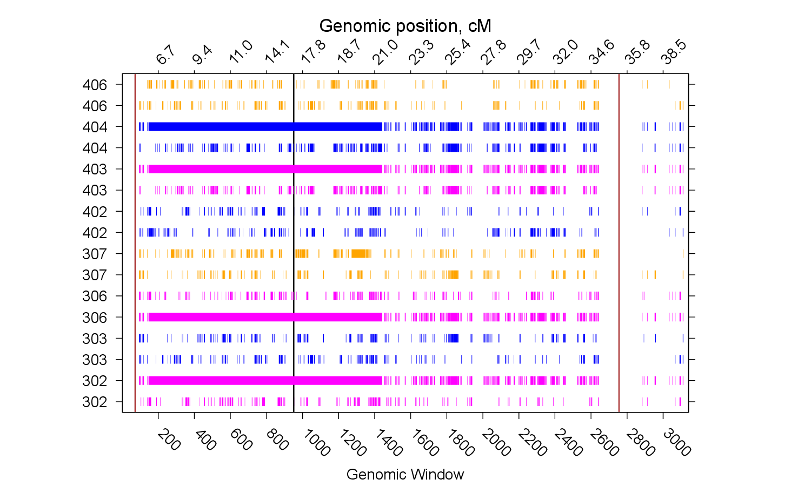

# `plot_haplotype_sharing.py`


🔗 [`plot_haplotype_sharing.py`](./plot_haplotype_sharing.py)

**Version:** 1.0  
**Author:** Rafael Nafikov  
**Date:** 2025-06-27

---

## Table of Contents
- [Folder Structure](#folder-structure)
- [Overview](#overview)
- [Requirements](#requirements)
- [Usage](#usage)
- [Arguments](#arguments)
- [Input Files](#input-files)
- [Output Files](#output-files)
- [Example](#example)
- [License](#license)
- [Support](#support)

---

## Folder Structure

```
plot_haplotype_sharing/
├── input_files
│   ├── additional_information.txt
│   ├── chr16_SNV_genomic_positions_B38.txt
│   ├── core_set_of_cases.txt
│   ├── haplotype_sharing_patterns.txt
│   └── ped52.txt
├── output_files
│   ├── genomic_windows.txt
│   ├── gnuplot_data_page_1.dat
│   ├── gnuplot_data_page_2.dat
│   ├── gnuplot_data_page_3.dat
│   ├── gnuplot_data_page_4.dat
│   ├── gnuplot_output_legend.eps
│   ├── gnuplot_output_legend.pdf
│   ├── gnuplot_output_page_1.eps
│   ├── gnuplot_output_page_1.pdf
│   ├── gnuplot_output_page_2.eps
│   ├── gnuplot_output_page_2.pdf
│   ├── gnuplot_output_page_3.eps
│   ├── gnuplot_output_page_3.pdf
│   ├── gnuplot_output_page_4.eps
│   ├── gnuplot_output_page_4.pdf
│   ├── plot_haplotype_sharing.log
│   └── plot_script.gp
├── plot_haplotype_sharing.py
├── gnuplot_output_page_1.png
└── README.md

```

3 directories, 25 files

---

## Overview

`plot_haplotype_sharing.py`  is a Python utility for visualizing haplotype sharing data generated by **HaploGI**.
It helps illustrate the extent of haplotype sharing among subjects from a **core set of cases**, aiding in the identification of a shared **risk haplotype** and its **boundaries** within a specified **region of interest (ROI)**.

---

## Requirements

- Python 3.x
- NumPy
- Gnuplot installed and accessible via system PATH

---

## Usage

Run the script from the command line with the required inputs:

```bash
python plot_haplotype_sharing.py \
         --pedigree <pedigree_file> \
         --positions <positions_file> \
         --haploshare <haploshare_file> \
         --set <set_file> \
         [--roi <roi_bounds>] \
         [--x_start <start_window>] \
         [--x_end <end_window>] \
         [--outdir <output_directory>]
```
 
---

### Arguments

| Argument       | Required | Description                                                              |
|----------------|----------|--------------------------------------------------------------------------|
| --pedigree     | Yes      | Path to the pedigree file with family and individual IDs                 |
| --positions    | Yes      | Path to the genomic windows file (`genomic_windows.txt`)                 |
| --haploshare   | Yes      | Path to the `.mat` file containing haplotype sharing results             |
| --set          | Yes      | Path to the file listing subject IDs to plot                             |
| --roi          | No       | Genomic region of interest (`chr:start-end`) to highlight in the plot    |
| --x_start      | No       | Optional start window number for x-axis zooming                          |
| --x_end        | No       | Optional end window number for x-axis zooming                            |
| --outdir       | No       | Directory where output plots will be saved (default: current directory)  |

---

## Input Files

### 🔷 `chr16_SNV_genomic_positions_B38.txt`
```bash
1052701 3.767099
1052874 3.767696
1053095 3.768460
```

- Physical base pair position for each variant
- Genomic position of the variant in cM

### 🔷 `core_set_of_cases.txt`
```bash
302 306 403 408 411 501 504 506 511 512 513 516
```

This file contains a list of **case subject IDs**, separated by spaces, all on a **single line**.

- **No header row**

HaploGI uses this set of cases to **check for the existence of haplotype sharing** among them.

#### 🔷 Haplotype Sharing Patterns File Format:

```bash
Genomic_window 302 302 303 303 306 306 307 307 402 402 403 403 404 404 406 406 407 407 408 408 410 410 411 411 412 412 414 414 415 415 416 416 501 501 502 502 503 503 504 504 505 505 506 506 507 507 508 508 509 509 510 510 511 511 512 512 513 513 514 514 515 515 516 516
1 0 1 0 2 1 0 2 0 0 0 0 1 0 2 0 0 0 0 1 0 2 0 1 1 0 0 0 2 0 2 0 2 0 1 0 0 0 2 0 1 0 2 1 0 0 0 0 0 0 0 2 0 0 1 1 1 1 0 0 0 0 0 1 0
2 0 0 0 0 0 0 0 0 0 0 0 0 0 0 0 0 0 0 0 0 0 0 0 0 0 0 0 0 0 0 0 0 0 0 0 0 0 0 0 0 0 0 0 0 0 0 0 0 0 0 0 0 0 0 0 0 0 0 0 0 0 0 0 0
```

- The file **includes a header row**.
- The **first column** contains genomic window numbers.
- Each subject with whole genome sequencing (WGS) data is represented by **two consecutive columns**:
  - One for the maternal chromosome
  - One for the paternal chromosome
- Entries indicate the presence of a shared haplotype:
  - `1` = Shared haplotype present in a **case**
  - `2` = Shared haplotype present in a **control**
  - `0` = No shared haplotype present

This file contains information about haplotype sharing across all genomic windows evaluated.

### 🔷 `ped52.txt`
```bash
subject father mother sex phenotype 
********    
101 0 0 1 0
102 0 0 2 0
201 101 102 1 0
202 101 102 2 0
2010 0 0 2 0
301 201 2010 1 0
302 201 2010 2 2
```
The pedigree file contains **five space-delimited columns** with the following information:

1. **Subject ID**  
2. **Father ID**  
3. **Mother ID**  
4. **Sex**  
   - `1` = Male  
   - `2` = Female  
   - `0` = Unsexed / unknown  
5. **Phenotype**  
   - `1` = Control  
   - `2` = Case  
   - `0` = No phenotype data

#### File Format Notes

- **Header lines (above the main data) are ignored** by the program if they appear **before a line starting with `*`**.  
- You may include column headers before this marker.
- **IDs must not contain special characters** such as `#`, `*`, or `@`.

> **Note**: The `********` line acts as a marker—any content above this line is ignored during processing.

---


## Output Files

### 🟢 `gnuplot_output_page_*.eps` and `gnuplot_output_page_*.pdf`

These files contain haplotype sharing plots generated in both EPS and PDF formats.
There may be *multiple pages* depending on the data size. The Python script plots up to **3200 genomic windows** and **eight subjects per page**.

An example from the first page of the plot shows data for **eight individuals from Ped52** across **3200 genomic windows**:

<div align="center">
  
  <p><strong>Figure 1:</strong> Ped52 haplotype sharing plot on chr16.</p>
</div>

### 🟢 `gnuplot_output_legend.eps` and `gnuplot_output_legend.pdf`

These files provide the **legend** for the haplotype sharing plots, describing line styles and color codes used in the visualizations.

### 🟢 `gnuplot_data_page_*.dat`

These files contain haplotype sharing data in a format suitable for **Gnuplot**. Each `.dat` file corresponds to a specific page of plotted data.

### 🟢 `plot_script.gp`

This is the **Gnuplot script** used to generate plots from the `.dat` files. You can use it directly with Gnuplot to reproduce or modify the visualizations.

### 🟢 `genomic_windows.txt` 
```bash
Genomic_window	boundaries_bps	1_bp	2_bp	3_bp	4_bp	5_bp	6_bp	7_bp	8_bp	9_bp	10_bp	11_bp	12_bp	13_bp	14_bp	15_bp	16_bp	17_bp	18_bp	19_bp	20_bp	1_cM_pos	20_cM_pos
1	1052701-1055604	1052701	1052874	1053095	1053154	1053316	1053758	1053890	1054244	1054249	1054409	1054446	1054491	1054508	1054606	1054612	1054759	1055201	1055294	1055431	1055604	3.767099	3.77713
2	1055638-1059301	1055638	1055760	1055783	1055819	1055825	1055873	1055899	1055919	1055937	1055966	1056064	1057345	1057865	1058373	1058485	1058669	1058884	1059044	1059178	1059301	3.777248	3.789907
```
Where each row represents a genomic window, and the columns are as follows:

- Genomic_window: Sequential genomic window number.

- boundaries_bps: The genomic positions marking the start and end of the window (1st variant base pair position to the 20th variant base pair position).

- 1_bp to 20_bp: Base pair positions for 20 variants comprising the genomic window.

- 1_cM_pos and 20_cM_pos: The genomic position in centimorgan (cM) for the 1st and 20th variants within the genomic window.

### 🟢 `log_file.txt`:  
  A log summary of the processing steps, including any warnings and errors encountered during execution.

---

## Example

Unzip the `input_files` directory before running the script. Use the included example inputs to run:

```bash
python plot_haplotype_sharing.py \
         --pedigree ./input_files/ped52.txt \
         --positions ./input_files/chr16_SNV_genomic_positions_B38.txt \
         --haploshare ./input_files/haplotype_sharing_patterns.txt \
         --set ./input_files/core_set_of_cases.txt \
         --roi 5.022725-17.458897-35.141074 \
         --outdir ./output_files_test
```
📌 Note: Make sure to create the output directory using mkdir before running the script, if you are specifying --output_dir and it does not already exist.

---

## License

This project is licensed under the **GNU General Public License v3.0 or later** (`GPL-3.0-or-later`).  
It uses the SPDX license identifier `GPL-3.0-or-later` in source files for standardized license declaration.

You can view the full license text at:  
https://www.gnu.org/licenses/gpl-3.0.html

Unless required by applicable law or agreed to in writing, the software is distributed  
**"AS IS"**, without warranties or conditions of any kind, either express or implied.

See the [LICENSE](./LICENSE) file in this repository for complete details.

---

## Support

For questions, bug reports, or suggestions, please contact:  
📧 nrafscience@gmail.com  
🔗 [GitHub Issues](https://github.com/RafPrograms/HaploGI/issues)

