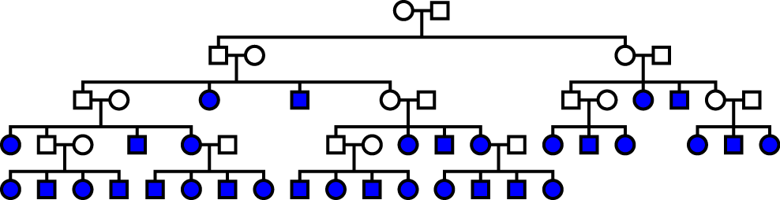
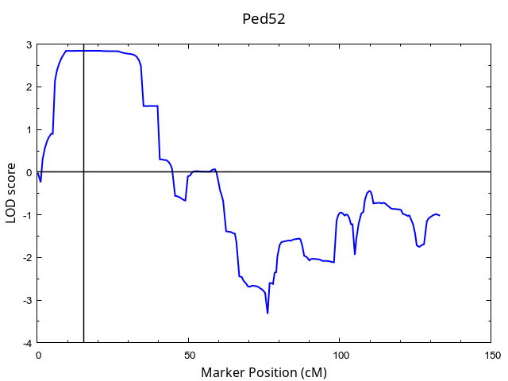

# Data Example: HaploGI – Haplotyping Given Inheritance

**Last Modified**: June 28, 2025  
**Author**: Rafael A. Nafikov  
Division of Medical Genetics, Department of Medicine, 
University of Washington  

---

## Contents
- [Introduction](#introduction)
- [Folder Structure](#folder-structure)
- [Description](#description)
- [How to Run This Example](#how-to-run-this-example)
- [HaploGI Utility Scripts](#haplogi-utility-scripts)
- [Citation](#-citation)
- [References](#references)
- [Web Resources](#web-resources)
- [License](#license)
- [Support](#support)

------------------------------------------------------------------------

## Introduction

This data example illustrates how to use the [HaploGI](https://github.com/RafPrograms/HaploGI/tree/main/src) program. It was created as described in Nafikov et al., 2025, with the only difference that the Whole Genome Sequencing (WGS) data was derived from [the 1000 Genomes Project](https://www.internationalgenome.org). The dataset is based on a model pedigree `ped52` (Figure 1). Only individuals marked in blue have data available.


<p align="center">
  
</p>

<p align="center"><strong>Figure 1:</strong> Ped52 pedigree structure.</p>


Multipoint linkage analysis was performed as described in Nafikov et al., 2018 to identify a genomic Region of Interest (ROI) for pedigree-based haplotyping and haplotype sharing analyses. The linkage analysis was performed using the [Morgan package](https://faculty.washington.edu/eathomp/Genepi/MORGAN/Morgan.shtml), and the results are shown in Figure 2. 

<p align="center">
  
</p>

<p align="center"><strong>Figure 2:</strong> Linkage analysis plot for chromosome 16, ped52 pedigree.</p>


A text file with linkage-marker specific LOD scores can be found at [chr16_ped52_LOD_scores.txt](https://github.com/RafPrograms/HaploGI/tree/main/data_example/background) – Text file with marker-specific LOD scores.

---

## Folder Structure

```
HaploGI_test_data/
├── full_run/
│   ├── full_input/
│   │   ├── chr16_linkage_markers_genomic_positions_B38.txt
│   │   ├── chr16_ped52.mi
│   │   ├── chr16_SNV_genomic_positions_B38.txt
│   │   ├── chr16_SNV_genotypes_B38.txt
│   │   └── ped52.txt
│   ├── full_output_example/
│   │   ├── allele2FGLinconsistency.txt
│   │   ├── core_set_of_cases.txt
│   │   ├── haplotype_sequences.txt
│   │   ├── haplotype_sharing_patterns.txt
│   │   ├── log.txt
│   │   └── shared_haplotype.txt
│   └── par_full.txt
├── haplosharing_run/
│   ├── haplosharing_input/
│   │   ├── chr16_linkage_markers_genomic_positions_B38.txt
│   │   ├── chr16_ped52.mi
│   │   ├── chr16_SNV_genomic_positions_B38.txt
│   │   ├── chr16_SNV_genotypes_B38.txt
│   │   ├── core_set_of_cases.txt
│   │   ├── haplotype_sequences.txt
│   │   └── ped52.txt
│   ├── haplosharing_output_example/
│   │   ├── haplotype_sharing_patterns.txt
│   │   ├── log.txt
│   │   └── shared_haplotype.txt
│   └── par_haplosharing.txt
├── haplotyping_run/
│   ├── haplotyping_input/
│   │   ├── chr16_linkage_markers_genomic_positions_B38.txt
│   │   ├── chr16_ped52.mi
│   │   ├── chr16_SNV_genomic_positions_B38.txt
│   │   ├── chr16_SNV_genotypes_B38.txt
│   │   └── ped52.txt
│   ├── haplotyping_output_example/
│   │   ├── allele2FGLinconsistency.txt
│   │   ├── core_set_of_cases.txt
│   │   ├── haplotype_sequences.txt
│   │   └── log.txt
│   └── par_haplotyping.txt
```

📦 Summary: 10 directories, 33 files

---

## Description

This data example contains separate folders for the three primary modes of running the `HaploGI` program:

- `full_run/` – for a complete haplotyping and haplotype-sharing analysis
- `haplosharing_run/` – for running haplotype sharing only (requires precomputed haplotypes)
- `haplotyping_run/` – for haplotyping only (no haplotype sharing analysis)

Each run folder includes:
- `*_input/` – Input files required by the tool (pedigree data, SNV positions, genotypes)
- `*_output_example/` – Example output files generated by `HaploGI` for that mode
- `par_*.txt` – Parameter file used to run `HaploGI` with the corresponding mode

Refer to the [HaploGI manual](https://github.com/RafPrograms/HaploGI/tree/main/docs) for detailed instructions on parameter settings and command-line options.

------------------------------------------------------------------------

## How to Run This Example

To run the full example:

```bash
./HaploGI --full ./par_full.txt
```

Make sure that you specify the correct file paths and desired output directory in the parameter file.  


For full details on how to test-run `HaploGI`, and for descriptions of required input/output file formats, refer to the following resources:

- 📄 [HaploGI manual (Markdown)](https://github.com/RafPrograms/HaploGI/tree/main/docs)  
or
- 📑 [HaploGI manual (PDF)](https://github.com/RafPrograms/HaploGI/blob/main/docs/manual_HaploGI_v1.0.0.pdf)

---

## 🛠️ HaploGI Utility Scripts

Python scripts are available to assist with:
- Preparing HaploGI input files
- Processing and summarizing output
- Visualizing haplotype sharing results

Available at:  
👉 <https://github.com/RafPrograms/HaploGI/tree/main/HaploGI_utility_scripts>

------------------------------------------------------------------------

## 📖 Citation

If you use `HaploGI` or this example dataset in your work, please cite:

Nafikov, R. A., Sohi, H., Nato Jr, A. Q., Horimoto, A. R., Bird, T. D., DeStefano, A., Blue, E. E., & Wijsman, E. M.  
*Variant prioritization by pedigree-based haplotyping*. Submitted for publication to *Genetic Epidemiology*, 2025.

 ---

## References

1. Nafikov et al., (2025). Variant prioritization by pedigree-based haplotyping. Submitted to *Genetic Epidemiology*.
2. Nafikov et al., (2018). Dealing with Admixture in Caribbean Hispanic Families. *Genetic Epidemiology*. [DOI:10.1002/gepi.22133](https://doi.org/10.1002/gepi.22133)
3. Tong & Thompson (2007). Multilocus lod scores. *Human Heredity*. [DOI:10.1159/000109731](https://doi.org/10.1159/000109731)

---

## Web Resources

- **HaploGI**: [https://github.com/RafPrograms/HaploGI](https://github.com/RafPrograms/HaploGI)
- **Morgan Package**: [Morgan site](https://faculty.washington.edu/eathomp/Genepi/pangaea.shtml)
- **1000 Genomes Project**: [https://www.internationalgenome.org](https://www.internationalgenome.org)

---

## 📜 License

This example dataset is for demonstration and testing only.  
See the [LICENSE](https://github.com/RafPrograms/HaploGI/blob/main/LICENSE) file for full terms.

---

## Support

For questions, bug reports, or suggestions, please contact:  
📧 nrafscience@gmail.com  
🔗 [GitHub Issues](https://github.com/RafPrograms/HaploGI/issues)

---